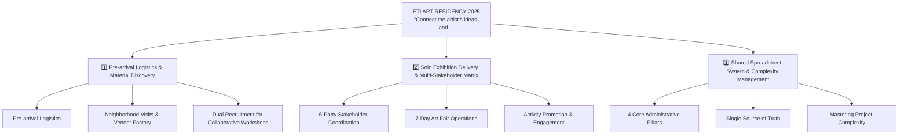
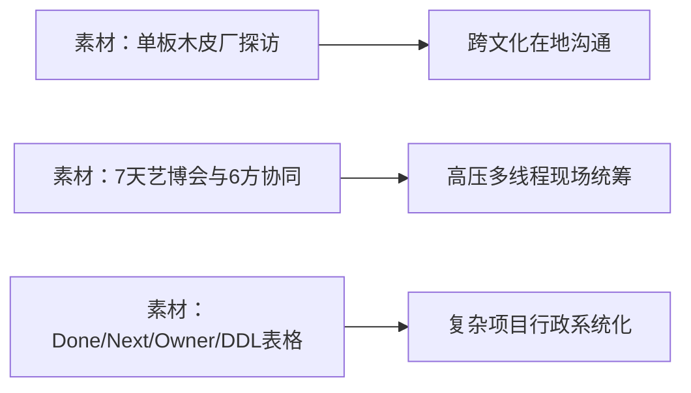

# 🧠 ETI ART RESIDENCY 2025
> **“Connect the artist's ideas and needs with local resources and people; anchor multi-stakeholder chaos with shared spreadsheet clarity.”**

> [!abstract] 这份笔记怎么用（30 秒读完）
> - **倒计时 3 天**：只看 §1 全景图 + §2 口诀组，确保能闭眼画出骨架、口述口诀；
> - **倒计时 1 天**：刷 §5 速记卡，看定位与锚点链，遮住核对区自己复述，再点开 `> [!quote]-` 核对；
> - **进考场 / 面试前 30 分钟**：只看 §4 数字记忆桩 + §6 难点话术，给大脑注入定海神针。

## 1. 🗺️ 一页全景图
> **记忆原理**：人脑对「空间并列结构」的编码速度远快于线性段落。先建地图，再填细节。



## 2. ⚡ 压缩口诀组
### 口诀 1 ｜ Pre-arrival Logistics & Material Discovery
| 一字诀 | 核心短语 | 还原解释 | 应用场景 |
|:-:|---|---|---|
| **P** | P字要素 | 紧扣该阶段核心动作与交付物 | 回答该阶段第一问 |
| **r** | r字要素 | 紧扣该阶段核心动作与交付物 | 回答该阶段第一问 |
| **e** | e字要素 | 紧扣该阶段核心动作与交付物 | 回答该阶段第一问 |
| **p** | p字要素 | 紧扣该阶段核心动作与交付物 | 回答该阶段第一问 |
| **N** | N字要素 | 紧扣该阶段核心动作与交付物 | 回答该阶段第一问 |

> [!tip] 一句话记住
> **“Prep Needs & Tools, Scout Veneer, Invite Residents”**

### 口诀 2 ｜ Solo Exhibition Delivery & Multi-Stakeholder Matrix
| 一字诀 | 核心短语 | 还原解释 | 应用场景 |
|:-:|---|---|---|
| **P** | P字要素 | 紧扣该阶段核心动作与交付物 | 回答该阶段第一问 |
| **a** | a字要素 | 紧扣该阶段核心动作与交付物 | 回答该阶段第一问 |
| **r** | r字要素 | 紧扣该阶段核心动作与交付物 | 回答该阶段第一问 |
| **t** | t字要素 | 紧扣该阶段核心动作与交付物 | 回答该阶段第一问 |
| **i** | i字要素 | 紧扣该阶段核心动作与交付物 | 回答该阶段第一问 |

> [!tip] 一句话记住
> **“6 Parties Aligned, 7 Days Anchored, Every Workshop Synced”**

### 口诀 3 ｜ Shared Spreadsheet System & Complexity Management
| 一字诀 | 核心短语 | 还原解释 | 应用场景 |
|:-:|---|---|---|
| **D** | D字要素 | 紧扣该阶段核心动作与交付物 | 回答该阶段第一问 |
| **o** | o字要素 | 紧扣该阶段核心动作与交付物 | 回答该阶段第一问 |
| **n** | n字要素 | 紧扣该阶段核心动作与交付物 | 回答该阶段第一问 |
| **e** | e字要素 | 紧扣该阶段核心动作与交付物 | 回答该阶段第一问 |
| **N** | N字要素 | 紧扣该阶段核心动作与交付物 | 回答该阶段第一问 |

> [!tip] 一句话记住
> **“Done, Next, Owner, Deadlines: 4 Pillars of Administrative Clarity”**

## 3. 🎯 匹配度 / 应用速记
| 目标要求 (Requirement) | 我的底牌 (My Card) | 一句话话术 (Punchline) |
|---|---|---|
| 复杂统筹 · Pre-arrival Logistics & Material Discovery | Pre-arrival logistics (needs, materi... | *“My role was to bridge artist needs with local soil, anchoring chaos with administrative rigor.”* |
| 复杂统筹 · Solo Exhibition Delivery & Multi-Stakeholder Matrix | Delivered a solo exhibition as part ... | *“My role was to bridge artist needs with local soil, anchoring chaos with administrative rigor.”* |
| 复杂统筹 · Shared Spreadsheet System & Complexity Management | Established a project administration... | *“My role was to bridge artist needs with local soil, anchoring chaos with administrative rigor.”* |

> [!note] 5 字优势口诀
> **「通 · 探 · 联 · 表 · 控」**（沟通前置、探访在地、联合多方、表格定序、掌控全局）

## 4. 🗃️ 案例池 + 复用矩阵


### 复用矩阵表
| 素材 / 钩子 | 主用途 (Primary) | 兼用途 (Secondary) | 调取关键词 |
|---|---|---|---|
| 模块 1：Pre-arrival Logistics & Material Discovery | 考察独立统筹与执行 | 考察突发问题与在地破冰 | #LouhangArtHill2025, #IsraeliArtistEti, #LocalVeneerFactory |
| 模块 2：Solo Exhibition Delivery & Multi-Stakeholder Matrix | 考察独立统筹与执行 | 考察突发问题与在地破冰 | #SoloExhibition, #6Stakeholders, #SevenDayArtFair |
| 模块 3：Shared Spreadsheet System & Complexity Management | 考察独立统筹与执行 | 考察突发问题与在地破冰 | #SharedSpreadsheets, #DoneNextOwnerDeadline, #ProjectAdministration |

### 数字记忆桩表
| 数字 | 记忆句 (Memory Anchor) | 对应事实 |
|:-:|---|---|
| **1** | **1 个月驻留**，为以色列艺术家 Eti 全流程定制人行宿物底座 | 驻留周期与主体 |
| **2** | **双轨招募**（社区走访面对面 + 社交媒体网络），攻克共创参与人数 | 共创工作坊破冰 |
| **3** | **3 大物料排期支柱**（materials, staff, schedules），支撑每场活动 | 7 天活动运营 |
| **4** | **4 维共享表格**（Done, Next, Owner, Deadline），终结多方混乱 | 核心管理系统 |
| **6** | **6 方利益相关者**（艺术家/设计/搭建/志愿者/主办方/文旅局）无缝同频 | 协同网络 |

## 5. 📇 五段式主动回忆速记卡
### Card 1 ｜ Pre-arrival Logistics & Material Discovery
**定位**：第 1 核心单元，口述作答建议控制在 90 秒内。

**锚点链**
`[LouhangArtHill2025 ➔ IsraeliArtistEti ➔ LocalVeneerFactory ➔ CollaborativeWorkshops ➔ BridgeArtistNeeds]`

**骨架**
```text
[Pre-arrival Logistics] Communicated about what she needed in advance; prepared mate...
[Neighborhood Visits & Veneer Factory] Accompanied her on neighborhood visits during the first few ...
[Dual Recruitment for Collaborative Workshops] Met local residents and invited them to participate, while r...
```

> [!quote]- 展开核对：完整提炼与原述回答
> **核心提问**：What specific preparations did you make before Eti arrived, and how did you connect her artistic vision with local community materials and residents?
>
> - **Pre-arrival Logistics: ** Communicated about what she needed in advance; prepared materials and tools, booked accommodation based on preferences, and arranged airport-to-residency transport.
> - **Neighborhood Visits & Veneer Factory: ** Accompanied her on neighborhood visits during the first few days; visited a local veneer factory where she found the main material for her work.
> - **Dual Recruitment for Collaborative Workshops: ** Met local residents and invited them to participate, while recruiting additional participants via social media to bridge artist ideas with local people.
>

**记忆抓手**：> [!tip]
> “Prep Needs & Tools, Scout Veneer, Invite Residents”

### Card 2 ｜ Solo Exhibition Delivery & Multi-Stakeholder Matrix
**定位**：第 2 核心单元，口述作答建议控制在 90 秒内。

**锚点链**
`[SoloExhibition ➔ 6Stakeholders ➔ SevenDayArtFair ➔ WorkshopsAndInterviews ➔ CultureAndTourism]`

**骨架**
```text
[6-Party Stakeholder Coordination] To deliver the exhibition, coordinated with: (1) Artist, (2)...
[7-Day Art Fair Operations] Managed several workshops and interviews during the seven-da...
[Activity Promotion & Engagement] Collected information about each activity for social promoti...
```

> [!quote]- 展开核对：完整提炼与原述回答
> **核心提问**：Who were the 6 stakeholders you coordinated to deliver the solo exhibition, and how did you manage the workshops and interviews during the 7-day art fair?
>
> - **6-Party Stakeholder Coordination: ** To deliver the exhibition, coordinated with: (1) Artist, (2) Visual Designer, (3) Installation Staff, (4) Community Volunteers, (5) Art Fair Organizer, and (6) Local Culture & Tourism Dept.
> - **7-Day Art Fair Operations: ** Managed several workshops and interviews during the seven-day art fair; coordinated materials, staff, and schedules for each workshop.
> - **Activity Promotion & Engagement: ** Collected information about each activity for social promotion and participant recruitment, ensuring seamless audience engagement.
>

**记忆抓手**：> [!tip]
> “6 Parties Aligned, 7 Days Anchored, Every Workshop Synced”

### Card 3 ｜ Shared Spreadsheet System & Complexity Management
**定位**：第 3 核心单元，口述作答建议控制在 90 秒内。

**锚点链**
`[SharedSpreadsheets ➔ DoneNextOwnerDeadline ➔ ProjectAdministration ➔ SingleSourceOfTruth ➔ KeepOrganized]`

**骨架**
```text
[4 Core Administrative Pillars] Used shared spreadsheets to clearly document: (1) what had a...
[Single Source of Truth] Kept all stakeholders and volunteers informed in real time, ...
[Mastering Project Complexity] Transformed a high-stress, multi-threaded exhibition into an...
```

> [!quote]- 展开核对：完整提炼与原述回答
> **核心提问**：How did your project administration system work, and how did it specifically keep this complicated project organized?
>
> - **4 Core Administrative Pillars: ** Used shared spreadsheets to clearly document: (1) what had already been done, (2) what needed to happen next, (3) who was responsible for each task, and (4) deadlines.
> - **Single Source of Truth: ** Kept all stakeholders and volunteers informed in real time, preventing misunderstandings, delays, and task duplication.
> - **Mastering Project Complexity: ** Transformed a high-stress, multi-threaded exhibition into an organized and resilient workflow: 'helped me keep a complicated project organized.'
>

**记忆抓手**：> [!tip]
> “Done, Next, Owner, Deadlines: 4 Pillars of Administrative Clarity”

## 6. 🛡️ 难点 · 已备话术
> **应对四步心法**：**认同痛点 ➔ 表明原则 ➔ 给出抓手 ➔ 交付结果**。

| 难点场景 / 追问 | 核心风险 | 已备应对原则与话术 |
|---|---|---|
| 追问：如果志愿者临时爽约怎么办？ | 现场活动脱节 | 提前在表格设立 Owner 备份制与浮动候补池，现场快速补位。 |
| 追问：外籍艺术家沟通有文化隔阂怎么办？ | 创作意图扭曲 | 倾听第一，陪同在地走访建立人际信任，用实体材料（单板木皮）建立共同事实。 |
| 追问：多方协作中主办方和文旅诉求冲突怎么办？ | 责任推诿 | 依托共享表格作为单一事实源（Single Source of Truth），把模糊口头诉求转化为明确 Deadline。 |

## 7. 🎭 高频素材的多场景用法
| 提问场景 | 调取本篇哪一段素材 | 怎么说（切入角度） |
|---|---|---|
| “请谈谈你最成功的一次项目协调经历” | 完整串联 Part 1~3 | 从前置后勤到在地探厂，重点落在 6 方协同与表格交付。 |
| “你如何处理工作中的巨大压力与多线程任务” | 聚焦 Part 3 (Spreadsheets) | 重点讲 Done/Next/Owner/Deadline 如何给团队和自己建立心理安全感。 |
| “你如何与不同背景的人建立合作关系” | 聚焦 Part 1 (Community) | 讲陪同走访单板厂、邀请居民与社交媒体双轨招募的破冰经验。 |

## 8. 🔍 反向提问 / 延伸思考
| # | 面试反向提问 | 考察用意 / 策略 |
|:-:|---|---|
| 1 | 团队在过往驻留项目中，最看重协调人在‘在地链接’还是‘行政流程’上的能力？ | 摸清团队文化偏好 |
| 2 | 针对跨部门（如设计、施工、文旅）的协作，目前团队采用什么协作工具与沟通节奏？ | 展示自己系统化接入的能力 |

## 9. ✅ 复习验收 Checklist
- [ ] 闭眼能徒手画出 §1 的 4 枝全景图树状结构
- [ ] 顺畅背诵 3 组口诀，并能向他人解释每个字的含义
- [ ] 盲测 5 个数字记忆桩（1、2、3、4、6），数字与事实完全焊死
- [ ] 随机抽取 1 张速记卡，不看核对区能在 90 秒内顺畅复述
- [ ] 针对 3 个难点追问，能按照四步心法脱口而出应对策略

## 10. 🏷️ 关键词速查表
| 维度 | 核心英文专有名词 / 短语 | 中文对照 |
|---|---|---|
| **人物与地点** | Louhang Art Hill, Israeli artist Eti, Local veneer factory | 楼巷艺术山、以色列艺术家Eti、单板木皮厂 |
| **核心机制** | Pre-arrival logistics, Collaborative workshops, Solo exhibition | 前置后勤、共创工作坊、个人展览 |
| **协同对象** | Visual designer, Installation staff, Community volunteers, Culture & Tourism Dept | 视觉设计、搭建布展、志愿者、文旅局 |
| **管理系统** | Shared spreadsheets, Single source of truth, Done/Next/Owner/Deadline | 共享在线表格、单一真实事实源、四大看板列 |

## 11. ⏳ 倒计时记忆排期
```text
[Day 1] 空间建模 ➔ 绘制 §1 全景图 + 熟记 §2 口诀组
   │
[Day 2] 深度编码 ➔ 默写 §4 记忆桩 + 过一遍 §5 速记卡（闭目复述）
   │
[Day 3] 极限自测 ➔ 全真模拟面试，快刷 §6 难点话术 + 验收 §9 Checklist
```

| 阶段 | 重点看哪一节 | 自测标准 |
|---|---|---|
| **D-3（建模）** | §1 全景图、§2 口诀组 | 白纸上能手绘树状分支 |
| **D-2（自测）** | §4 记忆桩、§5 五段卡 | 遮住核对区口述 90 秒无卡顿 |
| **D-1（冲刺）** | §6 难点、§7 多场景 | 面对突发追问能本能反应 |

**相关笔记**：[[ETI ART RESIDENCY 2025]] · [[STAR 面试法总览]] · [[复杂项目行政管理体系]]